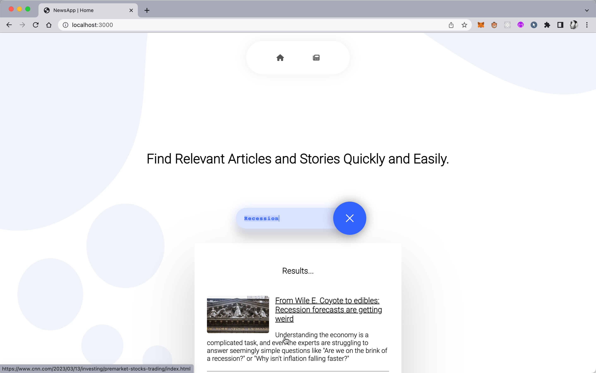

# NewsWave | NewsApp

[NewsWave](https://newswave.vercel.app/) is a news app built with Next.js, React, and NewsAPI that allows users to search for news articles by keyword or category, as well as view the top headlines of the day. The app provides a user-friendly interface.

> **_NOTE:_**  Search feature is only working on the localhost due to the developer plan of NewsAPI.

**Live Here:** [NewsWave](https://newswave.vercel.app/)

## Features

- Search for news articles by keyword (only working on localhost)
- View top headlines of the day
- Pagination on top news page
- View news category wise

## Getting Started

### Prerequisites
- Node.js and npm installed on your local machine
- API key from [NewsAPI](https://newsapi.org/)

### Installation

 1. Clone the repository: 
 `git clone https://github.com/your-username/newsapp.git`
 
 2. Navigate to the project directory: 
 `cd newsapp`

3. Install dependencies
`npm install`

4. Create a `.env` file and add your NewsAPI API key:
 `NEXT_PUBLIC_NEWS_KEY = your-api-key`

5. Run the development server
`npm run dev`

6. Open `http://localhost:3000` in your browser
## Usage

### Searching for articles
> **_NOTE:_**  This feature is only working on the localhost due to the developer plan of NewsAPI.
1. Type in a keyword or phrase in the search bar
2. Results will appear on the page with a summary of each article
3. Click on an article to read the full story on the source website

### Viewing top headlines
1. Click on the "Top News" button in the navigation bar
2. Results will appear on the page with a summary of each article
3. Click on an article to read the full story on the source website

### Viewing articles category wise
1. Select the category from the side bar on "Top News" page
2. Results will appear on the page with a summary of each article in the selected category
3. Click on an article to read the full story on the source website

## Screenshots

**Home Page**

**Search**

**Top News**

**Category**

